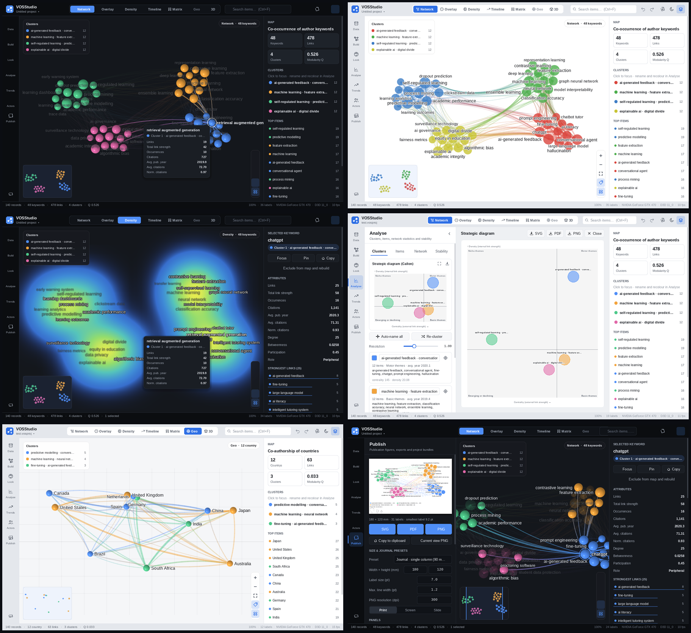
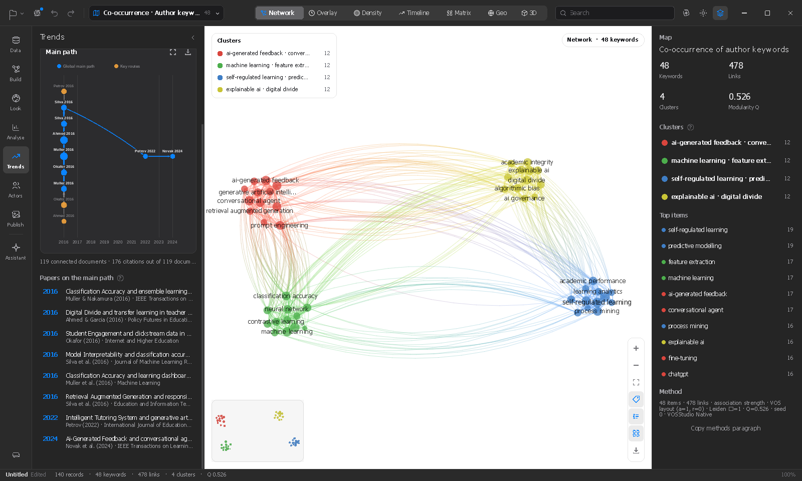
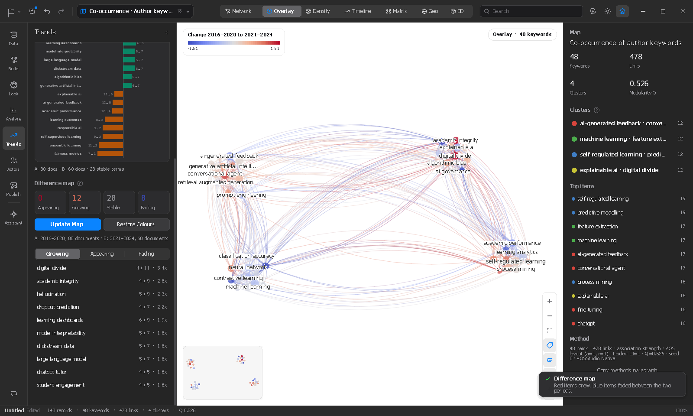
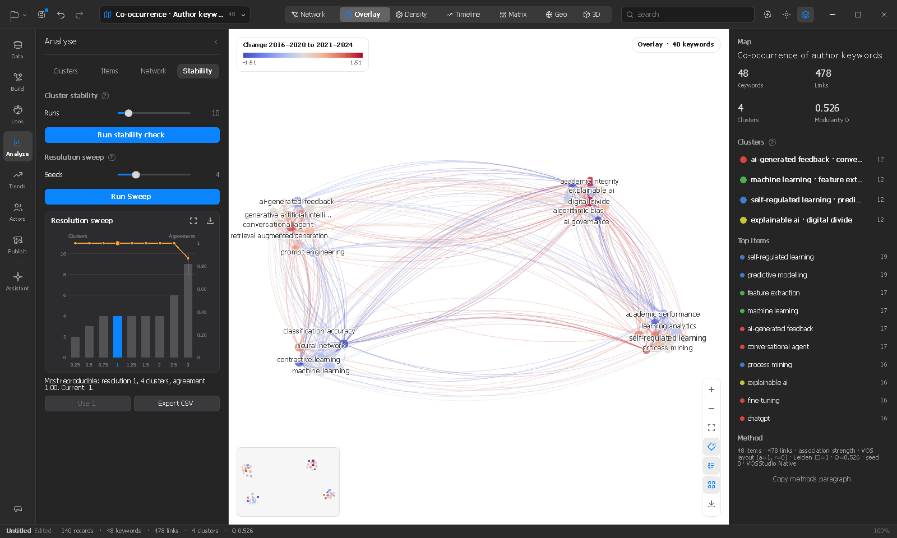
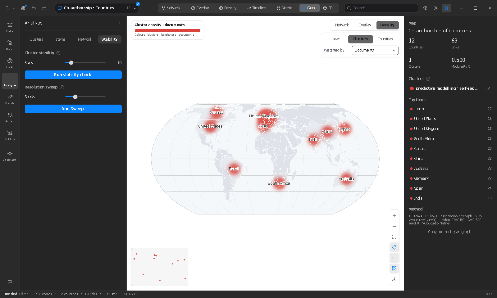
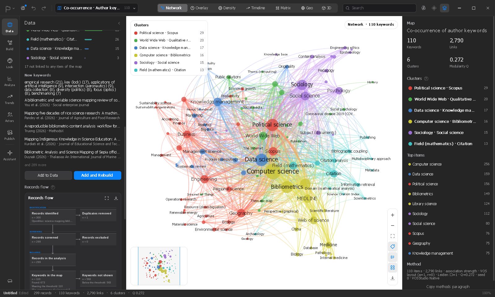
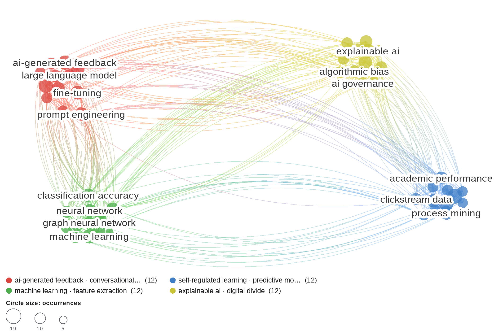
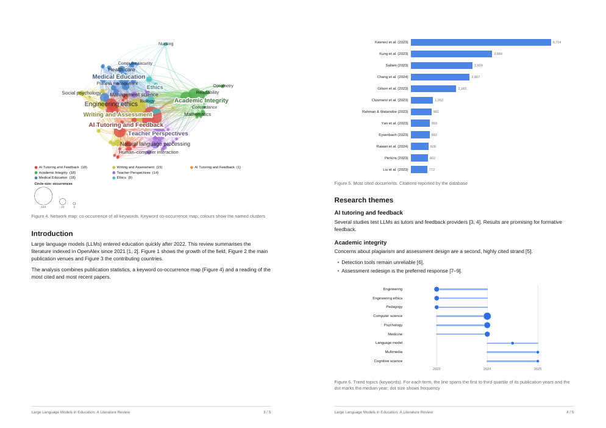

# VOSStudio Native for Windows

A native Windows port of VOSStudio v4. It maps bibliographic data and builds science maps, clusters, trends and publication figures. The portable Windows `VOSStudio.exe` embeds both PDFium and Tectonic; no separate engine installation or DLL is required. Tectonic fetches its TeX support bundle on the first Writer PDF compile and caches it for later use.



## Quick start

1. Run `VOSStudio.exe`. Windows 10 or 11 is required, with any GPU that supports D3D11 feature level 10.0 or higher. If there's no usable GPU, it falls back to the WARP software renderer.
2. **Try the sample** on the welcome screen, or drop Web of Science / Scopus / RIS / BibTeX / OpenAlex JSON / VOSviewer files onto the window.
3. **Build** (left rail) → choose the type, unit, counting method and threshold → **Build map** (`Ctrl+B`).
4. Switch views with `1`–`7` and restyle in **Look**. Explore **Analyse / Trends / Actors**, then export from **Publish** as SVG / PDF / PNG.

Press `Ctrl+K` (or `F1`) at any time for the **command palette**. Every action, look and view is searchable there.


## Touchscreen input (Windows validation pending)

When Windows touch hardware is available, the app registers its window for native touch input. A tap acts like a primary click; one-finger drags scroll UI lists and pan the map, PDF Reader, and Writer pages; long-press then drag selects text in Reader and Writer; two-finger pinches zoom the map, Reader, Writer, and figure preview. Mouse and keyboard input remain available. The app does not explicitly summon the Windows touch keyboard. This path has not yet been compiled or tested on a physical Windows touchscreen, so these interactions are implemented but **not yet validated as complete touchscreen support**.

## What's new in 1.19.0: turned pages, two pages, printing, and a reader that gives its memory back

- **Turn the view** (`R` clockwise, `Shift+R` anticlockwise; the toolbar's *View* button, right-click › *Turn
  clockwise*, *Read › Turn the view clockwise*; scripts `rdview turn|turnback|upright`). A scan that lies on its
  side reads upright; the rotation is kept with the PDF in the project. Everything works on the turned page —
  selection, highlights, notes, areas, search hits, links, the comment card — and area pictures come out as
  viewed. Nothing in the file changes.
- **Two pages, facing** (*View › Two pages*, *Read › Two pages*, `rdview two`), with *First page alone* for books
  and papers whose page 1 is a cover, so the pairs that face each other are the ones facing in print. Fit width
  fits the pair; `←`/`→` and the page buttons move a pair at a time. A setting of the reader, remembered.
- **Print…** (`Ctrl+P` in the reader, *View › Print…*, the *More* menu, *Read › Print…*): all pages, this page or
  a range (`1-3, 7, 12-`); with or without the project's **highlights, underlines, notes and areas** burnt onto the
  pages; fitted to the printable area; landscape pages turned to fit; the system's printer dialog for the printer,
  paper and copies. Pages are rendered by the engine at the printer's resolution (300 dpi at most) on its own
  thread, one at a time between the reader's tiles, so the reader stays fluid and a long print can run while you
  read on; the print card and the job were reviewed, not exercised (no printer here).
- **Memory, in tiers.** While the reader is open nothing changed — its budgets already keep it small (tiles beyond
  the view leave after 1.5 s, text and previews are kept for 24 pages). On *close*, the tiles and previews go at
  once and the engine's page objects are dropped; 45 s later the document is closed; 90 s after that, in a quiet
  moment (no input for 2 s, no job), **the engine library itself is destroyed** — the only way its allocator
  returns memory — the GPU's transient allocations are trimmed and the process working set is trimmed once. The
  next open starts the engine again in milliseconds. Nothing trims periodically: a working set trimmed while you
  work only comes back through page faults, as stutter. Details and the reasoning in `docs/PDF-READER.md` §3.
- `Ctrl+P` in the reader now prints; the command palette stays on `Ctrl+K` and `F1` (and on `Ctrl+P` everywhere
  else).

## What's new in 1.18.0: Get PDF

- **Get PDF.** *Read › Get PDFs…*, the **Get PDFs** button and the PDF cells of the papers table, the *Read* menu,
  the assistant (`get_pdfs`) and scripts (`getpdf`) fetch the **open-access copies** of the records that have a DOI
  and no file yet, store them in `<project> attachments\` next to the project (or `Documents\VOSStudio\Attachments`),
  attach them to the reading library and link them to the records. Three channels, in order: **OpenAlex's own
  cached copies** (with a free OpenAlex key — about nine in ten open papers, a cent each of the key's $1/day),
  the open locations OpenAlex and Unpaywall list (published version before manuscript before preprint), and
  **arXiv**. A download is accepted only when its first bytes are a PDF, and the file is checked (end marker, size,
  the engine opens it) before it is attached. Papers that are not open, or whose site refused the automatic
  download, are **listed with the reason** on the Read page (*Without a PDF*) and marked in the papers table, with
  the manual path one click away — *Attach a file…*, the DOI page, the open-access link — and the hint that a free
  OpenAlex key would fetch the copy when OpenAlex has one. See `docs/OA-FETCH.md`.

## What's new in 1.17.0: a dark page for the reader

- **Dark page** in the PDF reader (`D`, the sun/moon button, right-click › *Dark page*, *Read › Dark page*),
  independent of the application theme and remembered across sessions. Pages are drawn light-on-dark with the
  colours' hues kept — paper `#1c1c1c`, ink `#e6e6e6`, a blue link pale blue — and **photographs are recognised
  and left as they are** (plots, diagrams and scans invert like text). It costs about half a millisecond per
  tile; copies, figures and *Save into PDF* keep the original colours. See `docs/PDF-READER.md`.
- **Open-access PDF fetching, measured before it is built.** `tools/oa_probe.py` ran against Unpaywall, OpenAlex,
  Semantic Scholar, Europe PMC, Crossref and the publishers themselves for a stratified sample of real DOIs; the
  results and the resulting design are in `docs/OA-FETCH-TEST.md` and `docs/OA-FETCH-PLAN.md`.

## What's new in 1.16.0: linked views, area annotations, long lists that stay fast

- **Linked views in the split view.** A pane can now be a **second live view of the map** — overlay, density,
  timeline, geography, 3D or another network view — not only a picture of it. Each linked view has its own camera
  (wheel to zoom, drag to pan, orbit in 3D, double-click on empty space to fit) and view kind, on the same data
  and positions as the main map; selection, cluster filter, search hits and the hovered item are **shared**, so
  pointing at a term in the density pane highlights it in the network pane and in the main map, a click selects it
  everywhere and a double-click brings the main map to it. Choose *Linked view: …* from a pane's chip; the *swap*
  button makes the linked view the main one (with all its tools — dragging items, box selection, minimap,
  legends) and puts the previous main view in the pane. Any number of panes can be linked views; the main map
  remains one, because it is the application's canvas. The chart list also has pictures of the timeline,
  geography, 3D and matrix views now (`map_timeline`, `map_geo`, `map_3d`, `map_matrix`), and the assistant's
  `split`/`pane` commands accept `live:overlay`, `live:density`, `live:timeline`, `live:geo`, `live:3d`,
  `live:network`.
- **Area annotations in the reader.** Scanned PDFs, figures, tables and equations have no selectable text; the
  **Area tool** (`A`, or hold `Alt` and drag at any time) draws a rectangle on the page. The mini toolbar codes it
  with the same seven codes, comments on it, **copies it as a picture**, **puts it in the document as a figure**
  (captioned with the paper and page, cited when the PDF is linked) or deletes it. The text under the rectangle,
  when the page has a text layer, is kept as the passage, so notes exports and the coding matrix treat it like a
  highlight; saving into the PDF writes it as a Square annotation. OCR of scans is not included.
- **The Outline pane no longer slows the application down.** A book's outline with thousands of entries was
  measured and laid out in full every frame (three text layouts per entry) and dragged the whole window to a few
  frames per second while the pane was open. Row heights are now measured once per document, width and scale,
  and only the rows in view are drawn; the *Highlights* list, the *Find* results and the reading list on the Read
  page work the same way, and the reading list no longer checks every file on disk every frame (a stat per row
  per frame, painful on a network share) — existence is re-checked every few seconds.
- **Minimap with very few items**: a map of two items drew circles far bigger than its box. The scale now fits
  the items *and* their marks (VOS-style marks are capped at a fifth of the box), a zero extent (one item, items
  on a line) no longer divides by zero, and the drawing is clipped to the box.

## 1.15.1: the reader after its first day of real use

Fixes from testing 1.15.0 on Windows — all in the Read stage, nothing else changed:

- **Crash on opening a second PDF** (attach while one was open, open another paper, reopen after a project
  recovery): the toolbar asked for the current page while the new document had no pages yet but the geometry of
  the previous one was still there — a null read at `readerCurrentPage`. The geometry is now cleared with the
  document and every lookup is bounded by both.
- **Comments could not be saved.** The Save button (and the row's icons) sat inside the list row, whose hit test
  claimed the click first. Comments are now written in a **card that floats next to the highlight or note**: click
  a highlight (or the toolbar's *Comment*, `N`, right-click › *Add a comment*) and type; the text is stored as you
  type, `Enter`/*Done*/a click elsewhere closes the card, the coloured dots re-code the passage, the bin deletes
  it. The *Highlights* pane lists everything and its buttons work.
- **Horizontal scrolling and scrollbars**: thin draggable thumbs at the right and bottom edges (click the track
  to page), `Shift`+wheel and a touchpad's sideways swipe (`WM_MOUSEHWHEEL`) scroll sideways, `←`/`→` too while
  the page is wider than the view; the writer takes the sideways swipe as well.
- **Memory.** Tiles are capped at 48 MB and, above 16 MB, anything that left the view for 1.5 s is dropped, so the
  footprint no longer grows while scrolling; text and previews are kept for 24 pages; the engine keeps 3 loaded
  pages instead of 6. Closing the reader frees the tiles and previews at once and the document 45 s later
  (coming straight back is instant). Measured on Linux with a 40-page paper with figures: the engine holds
  15–20 MB while scrolling and returns to 11 MB after the close.
- Smaller: opening a paper no longer re-reads it for a DOI when it is already linked; *Quote*/*Cite* open the
  writer underneath without closing the reader; the password box gets the caret; stale results of a previous
  document can no longer land on the next one (a monotonic generation).

## What's new in 1.15.0: the Read stage — a PDF reader and a reading library for a systematic analysis

The left rail is now the order of a systematic bibliographic analysis: **Data → Build → Look → Analyse → Trends →
Actors → Read → Write → Publish**. *Read* is new; `docs/PDF-READER.md` is its guide.

- **A native PDF reader in the main area**, on PDFium (Chromium's engine, BSD-3). Continuous pages, eased zoom
  around the pointer, tiles rendered on an engine thread at the resting scale while the previous ones are
  stretched, so scrolling and zooming stay at the frame rate; text selection (drag, word, line), find with
  context, outline, links, password files. The engine's `pdfium.dll` is **inside the executable** (compressed
  resource, unpacked to the profile on first use) — still one file, nothing to install.
- **A reading library in the project.** Attach PDFs (button, drop, the new *PDF* column of the papers table, a
  record's preview); they are linked to the records by DOI or title. Per paper: status (*to read / reading /
  read / excluded*), a 1–5 rating, tags, reading notes, the last position. The Read page is the reading list:
  progress, filters, search over notes and highlights, *next up*, missing-file flags.
- **Highlight and code while reading.** Select text → a two-row toolbar at the pointer: seven codes (*Aim, Method,
  Finding, Theory, Gap, Quote, Question*, keys `1`–`7`), highlight, underline, note, copy, **Quote into the
  writer** (a *Quote* paragraph with a native citation) and **Cite**. Marks live in the project, are listed and
  edited in the *Highlights* pane, and can be **saved into the PDF** as standard annotations on request.
- **Synthesis exports**: every paper's notes and coded highlights as Markdown; a **coding matrix** CSV (one row
  per paper, one column per code) for the thematic synthesis.
- **The assistant reads along**: `reading_list`, `open_pdf`, `set_reading`, `paper_notes` tools (1.18: `get_pdfs`); `open_page` knows
  *read*. A *Read* menu; *Help › Third-party notices* for the engine's licences.
- The writer's selection toolbar is now **two rows** close to the pointer instead of one long line.

Verified on Linux against `libpdfium.so` (engine, inflater, library model, exports, search, annotation round
trips; 20 test programs). The Windows user interface of the reader compiles cleanly but was not run on Windows
in this session — the first run is a test run.

## What's new in 1.14.0: Word's source list, vector figures, zoom past the width, the mini toolbar

Everything here came out of a session with the 1.13 writer against a real Word 365.

- **Cited sources go into Word's own list.** Word does not read the bibliography data store from clipboard HTML
  (it does from `.docx`), so the writer now adds the cited sources to the open Word document by automation as you
  copy (`Ctrl+C`; *Settings › General* to turn it off): the pasted `CITATION` fields resolve immediately and the
  bibliography and citation style are yours to manage in Word. A plain copy no longer appends a reference list.
  **Paste into Word at the cursor** (`Ctrl+Shift+C`, Write menu, context menu) does the whole thing — sources,
  paste, field update — and starts Word if it is not open. *Copy with reference list* remains in the Write menu.
- **Figures copy as vector graphics.** Select a figure and `Ctrl+C`: the clipboard gets an Enhanced Metafile (EMF+),
  a PNG and a bitmap, and Word / PowerPoint / Excel paste a scalable drawing. In mixed text + figure copies the
  vector figures travel as Word's VML picture syntax (`.emf`) with a PNG fallback for other applications.
- **Zoom past fit-to-width**, with a horizontal scrollbar, `Shift`+wheel and zoom-around-the-pointer; a *fit*
  button beside the zoom slider; wide pages open fitted.
- **The mini toolbar**: after a mouse selection a compact Word-style format bar appears above the pointer (style,
  font, size ±, B / I / U / S / highlight, colour, lists, citation, link) and rides on top of the context menu on a
  right-click. A right-click shortly after a selection keeps the selection.
- `docs/PDF-READER-PLAN.md` gained a section on why the coming PDF reader will not use a home-grown engine.

## What's new in 1.13.0: Word round trip, a split view, and a lighter writer

- **Copy → paste into Word keeps everything.** A copy from the writer puts, beside the plain text, the HTML dialect
  Word writes itself on the clipboard: Word paragraph styles (Normal, Heading 1–4, Title, Caption, Quote,
  Bibliography), real bulleted / numbered lists, grid tables, pictures (as files Word picks up), `SEQ` fields in
  captions — and **citations as Word's own `CITATION` fields**, with the sources delivered as the bibliography
  data store Word reads from HTML (`<link rel=dataStoreItem>`, the same `b:Sources` part as the `.docx` export). After
  a paste, *References › Manage Sources* knows the sources, *Insert Bibliography* lists them and no citation has to
  be re-entered (1.14: the sources now travel by automation, see above). **Copy with reference list** (Write menu)
  appends a *References* heading with a `BIBLIOGRAPHY` field for exactly the sources the selection cites. A copied figure also travels as a
  picture. **Open in Word** (Export menu) writes the `.docx` to *Documents\VOSStudio\Reports* and launches Word.
- **Paste from Word (or a browser) keeps the structure**: headings, list paragraphs (Word's `mso-list`), tables,
  bold / italic / underline / strike / sub / sup, links, fonts, sizes, colours and highlights come in as such; Word's
  hidden field codes and list bullets are skipped.
- **Split view**: the main area in two (side by side or stacked) or four panes, each showing any chart of the
  loaded data — one of them the live map if you want it — chosen per pane from a picker. *View › Split view*,
  `Ctrl+Shift+2` / `Ctrl+Shift+4`, palette, `split` / `pane` commands (also for the assistant), a pane can be shown
  alone for a moment, sent to the writer or saved as PNG. The layout is remembered.
- **The writer is lighter and zooms like Word**: the pages are laid out once at 100 % and zoom is a pure
  transform (no relayout at any zoom step, line breaks never move), the easing is clocked (same feel at 60 or 144 Hz),
  precision touchpads / pinch give fractional steps, and a **zoom slider** sits in the status bar (40–300 %, notch
  at 100 %). Figure bitmaps are re-rendered only once the zoom rests and live in an LRU with a 96 MB budget that is
  released when the writer is not shown; the layout pass returns immediately when nothing changed; the status-bar
  counts are cached; the undo history is bounded by bytes (24 MB) as well as steps; chart bitmaps across the
  application share a 64 MB budget.
- **Design only, not built**: `docs/PDF-READER-PLAN.md` — how an in-application PDF reader (PDFium, highlights,
  notes, cite-while-you-read, figure clipping) would be added and what it would enable.

As before, the Windows layer was compiled but could not be run here; the clipboard HTML, its round trip and the
citation fields are covered by `tests/clip_test.cpp` (host), Word itself was not available to test the paste.

## What's new in 1.12.0: the writer becomes a page, with real pages

Everything in this release comes from the first round of use on Windows:

- **Write is a page of the left rail** (between Publish and Assistant), not an overlay: its panel has the outline,
  quick inserts, exports and the citation style; the document fills the main area. `Ctrl+Shift+W`, the pen button
  and the Write menu open it too. A **menu bar** (File, Edit, View, Map, Analyse, Write, AI, Help, with cascading
  submenus and the same shortcuts as the palette) replaces the file-menu button at the top left; the map chip has
  moved to the right, next to the search box.
- **Real pagination**: the document is laid out on A4 / Letter pages on screen, exactly as the PDF prints them:
  paragraphs break between lines with widow/orphan control, tables between rows, headings stay with their text, a
  page break starts a new page, running head and page numbers are shown; the status bar says *Page x of n*.
- **Smooth zoom**: `Ctrl`+wheel zooms around the mouse by scaling the pages; the text is re-laid out once the zoom
  settles (no more per-step relayout).
- **Fonts, sizes, colours per selection** (toolbar font box listing the installed families, size box and
  `Ctrl+Shift+>` / `<`, a colour palette), a two-row toolbar that reflows on narrow windows, a scrollable
  **Properties pane** (page, paragraph, text, figure, table, citations, document), a **citation picker** listing all
  loaded papers with search, scrolling and multi-select, a Word-style **context menu** with a mini format bar and
  sub-pages (style, font, insert, table, figure), and more figure options (width 40–100 %, alignment, caption
  above/below, border, label *Figure / Fig. / Chart / Map / …* or none, alt text).
- **Citations are keyed fields**: one bibliography (`Document.refs`) and a **citation style** selector (APA 7,
  IEEE, Harvard, Chicago author-date, MLA, Vancouver, …). In-text citations and the reference list are regenerated
  in the chosen style everywhere; in Word they are **native citations** (`CITATION` fields with the sources in
  `customXml`), so *References › Style* in Word restyles them and the bibliography updates.
- **Per-figure export format**: vector (SVG in Word / HTML) or PNG, per figure or as a document default.
- Fixed: the outline icon was invisible (the icon name did not exist), the Page tab overflowed without scrolling.

The Windows layer of this release was compiled but, as before, could not be run here; the core (pagination
model, citations, exports) is covered by `tests/doc_test.cpp` and the DOCX output by the Open XML SDK validator.

## What's new in 1.11.0: the writer — a document editor in the application

The report is no longer a hidden buffer that only the AI could fill: **the writer** (pen button in the top bar,
`Ctrl+Shift+W`, palette *Writer*, `writer` command) is a page in the main area where the report is written,
edited and exported. What you see is one document (`src/core/doc.h`) shared by the editor, the assistant's report
tools and the three exporters:

- **Editing** like a native word processor: paragraph styles (Title, Subtitle, Heading 1–4, Body, Bullet, Number,
  Quote, Code, Caption, Reference), bold / italic / underline / strike / sub / sup / code / highlight / links,
  alignment, three-level lists, tables (insert, rows/columns, header row, column alignment, Tab between cells),
  figures from any chart of the loaded data or the current map view at 50–100 % width with numbered captions,
  citations of the loaded papers (`[n]` + APA reference with DOI link under *References*), page breaks, rules,
  a table of contents, numbered headings, find and replace, rich clipboard, drag selection, double/triple click,
  zoom, undo/redo, an outline pane, a page-setup pane (A4/Letter, margins, font, size, author, keywords), a
  context menu and a full keyboard map (`docs/EDITOR.md`).
- **Exports** from the same document: print-ready **PDF** (vector figures, TOC with page numbers, page numbers),
  **Word** (`.docx` with Word's own styles, real numbering, tables, pictures, captions, TOC field; Open XML SDK
  validated) and a self-contained **HTML** page. `writer pdf|docx|html|all`.
- **The assistant writes into the writer**: `add_section`, `add_chart`, `write_report`, `edit_section` change the
  document you are editing (each as an undo step), `get_report` reads it back including your edits, and
  `export_report` supports `pdf|docx|html|both|all`. The document is saved in the project file.
- Windows drawing layer built and compiled here but not run (no Windows in the build environment): please report
  anything odd. The core editor and the exporters are unit-tested (`tests/doc_test.cpp`).

## What's new in 1.10.1: a Word writer that Word likes

The 1.10.0 Word export was often wrong: every hard-wrapped line of the assistant's text became its own paragraph,
the section title appeared twice, list continuations broke lists, nested bullets flattened, quotes kept their `>`,
Markdown tables, rules, code blocks, `####` headings and `<sub>` tags came out as literal text, a stray `*` turned
the rest of a paragraph italic, links were not clickable, tab characters sat inside text runs, and several element
orders violated the WordprocessingML schema (Word 365 repairs such files or refuses them). The writer
(`src/core/docx.cpp`) has been rebuilt as a proper Markdown → WordprocessingML converter:

- **Blocks**: paragraphs (soft-wrapped lines joined), headings `#`–`######` and bold-only lines (mapped under the
  section's heading level, never above it), bulleted and numbered lists with nesting and continuation lines (real
  Word numbering: each `1.` list restarts at its own number), block quotes, fenced and indented code, horizontal
  rules, pipe tables (with or without outer pipes, `:---:` alignment, escaped pipes, `<br>` in cells; 8+ columns
  get a smaller font), and *Table n.* / *Figure n.* lines as Word captions.
- **Inline**: `**bold**`, `*italic*`, `_italic_`, `` `code` ``, `~~strike~~`, `[text](url)`, bare URLs and DOIs
  as clickable hyperlinks, `<sub>`/`<sup>`/`<b>`/`<i>`/`<br>`, HTML entities, backslash escapes; unbalanced
  markers stay literal (`p < 0.05*`, `snake_case_names`).
- **Document**: `Title`, `Subtitle`, `Heading 1–4`, `List Paragraph`, `Caption`, `Quote`, `Bibliography`,
  `Hyperlink` and table styles as Word defines them, figures as inline pictures with alt text and `SEQ Figure`
  caption fields (so *Insert Table of Figures* and cross-references work), tables with repeated header rows and
  right-aligned numeric columns, a hanging-indent reference list, *Page X of Y* footer, document properties,
  UTF-8 repair for mis-encoded input, and compatibility mode 15 (no "Compatibility Mode" banner in Word).
- **Validation**: `docx_test` grew to ~90 checks and writes two sample files (`make docx-samples`); both pass the
  Open XML SDK validator with zero errors against the Office 2013 – Microsoft 365 schemas (the CI runs it), load in
  python-docx and render correctly in LibreOffice. Word itself was not available where this was built — please open
  a real report in Word once; the file is designed to open without a repair prompt. Details: `docs/WORD-EXPORT.md`.

## What's new in 1.10.0: compare mode, linked selection, Word reports, cleaning 2.0, release files

**Compare mode (Trends › Compare).** Three kinds of comparison, one pair at a time:
- *Periods* — two year ranges of the loaded records (as before, plus the new side-by-side figure);
- *Sources* — two imported files (Web of Science vs Scopus, two searches, two downloads of the same query);
- *Thresholds* — the same map at two minimum item weights, to see what a stricter threshold would drop.

*Side by Side* puts both halves into the main area as one figure on the map's own layout: the same item sits in the
same place on both sides, its circle size is its share of the documents on that side, items absent from a side are
faded, and the subtitles carry the document counts. *Difference map* (periods and sources) colours the map by the
change from A to B — appearing, growing, stable, fading — and the tab lists the items in each class. The figure
closes with *Close*, `Esc`, a map view or a new map. Scripts: `compare periods a0 a1 b0 b1`, `compare sources 1 2`,
`compare thresholds 5 10`, `compare side|diff|off`; assistant tool `show_compare` (kind, layout, years, files or
thresholds).

**Linked selection.** Clicking a cluster (a cluster card, the map, `focus_cluster`) now scopes the application to the
records behind that cluster: the Trends tabs (growth, bursts, themes, evolution, topics, RPYS, production), the Actors
tabs (authors, sources, countries, organisations, collaboration, documents), the papers table and the geo view all
show only those records, with a banner (*Scope: cluster 3 · Machine learning · 87 records*) and one click back to the
whole corpus. Selecting items on the map scopes the same way to the records that contain them. Charts, cards and
geo counts recompute once per scope change and are cached. *Unlink* on the banner turns linked selection off (a
saved setting; the highlight then only dims the map, as in 1.9) and *Link* turns it back on; scripts `scope cluster <n>`,
`scope off`, `scope link on|off`.

**Writing studio → Word.** The report (Assistant › Report) exports as an editable `.docx` besides PDF: real heading
styles, a numbered figure for every chart with its caption, the data tables as Word tables, and the reference list.
The Word writer is our own (no dependencies; `src/core/docx.cpp`), so the file opens in Word, LibreOffice and Google
Docs. Assistant tool `export_report` takes `format: pdf|docx|both`. Any selection of records — the papers table's
selected or filtered rows, a scoped cluster — exports as RIS, **BibTeX** (new), CSV or Web of Science text; the Data
page and `records bib <file>` write the whole corpus as BibTeX.

**Data-cleaning studio 2.0 (Data › Clean).**
- *Author disambiguation*: name variants are grouped by ORCID / researcher id when the file has them (Web of Science
  `OI`/`RI`, Scopus author ids, OpenAlex ids), then by surname + initials, and split again by affiliation when the same
  name occurs at unrelated institutions; the proposal shows why two names were joined.
- *Term normalisation*: plural/singular, British/American spelling, hyphen and space forms, lemmatised heads
  (*networks analysis* → *network analysis*) and acronym expansion from a built-in dictionary plus the acronyms the
  abstracts define themselves (*long short-term memory (LSTM)*), so *LSTM* and its expansion merge.
- *Cross-source de-duplication*: records from different files are matched on DOI, then on normalised title + year
  (+ first author when the year is missing); the merged record keeps the richer field of each pair.
- *Ranked suggestions*: every proposal carries a confidence (rule score, or the AI's when *Ask the AI* was used); the
  list is sorted by it, high-confidence groups are pre-ticked, doubtful ones are not; nothing merges without *Apply*,
  and *Undo* reverts the last merge. The result exports as a VOSviewer thesaurus file (`Export…`), so the same cleaning
  can be reused in VOSviewer or another project.

**Release files.** `LICENSE` (MIT), `CITATION.cff` (GitHub's *Cite this repository*; add your names and a DOI),
a GitHub Actions workflow (`.github/workflows/ci.yml`: Linux tests, MinGW x64 build with embedded PDFium and
Tectonic, downloadable executable and portable ZIP on each successful push, release assets on tags), and an
installer script (`installer/VOSStudio.iss`: per-user install, Start menu, `.vosproj` association). `make test`
compiles the core once into a host library and runs all 28 test programs; the latest complete host run passed, with
`pdf_test` explicitly skipped because the optional Linux PDFium runtime was unavailable.

## What's new in 1.9.9: the papers table, an assistant that cannot destroy your data, figures in the main area

**The top bar was dead while the Live pop-up moved (fixed).** With the Live AI pop-up open, the search field and
the other top-bar buttons could not be clicked or typed into. Cause: while only the pop-up is redrawn (the cheap
overlay-only frames introduced in 1.9.3), the window's caption hit test forgot where the top-bar widgets were and
treated every click up there as a title-bar drag. Overlay-only frames now keep the last full frame's widget map, the
hovered widget, its tooltip and the cursor; clicking the search field with the pop-up open focuses it, as before.

**Papers table (`Ctrl+T`, the table button in the top bar, *Browse All Papers* on the Data page, the palette).**
Every record of the project as one list in the main area: sortable by year, title, authors, source and citations
(click a column header; the secondary order is always citations, then year), a filter box that matches words against
title, authors, source, keywords, DOI and year (`2015-2020` is a year range), *Detailed* rows (keywords or document
type and DOI under the title) or *Compact* single lines, virtual rows (only the visible ones are laid out, so tens of
thousands scroll smoothly), a row click opens the document preview in the inspector, `↑ ↓ PgUp PgDn Home End` move
through the list with the preview following, `Ctrl`/`Shift`+click select rows, and *Export* writes the selection or
the filtered list as RIS, CSV (Scopus columns) or Web of Science text, or copies a reference list to the clipboard.
Columns fold away on narrow windows (source first, then authors). `Esc`, a map view or a new map bring the map back.
Scripts and the assistant: `papers [off|<filter words>]`, tool `show_papers`.

**The assistant can no longer wipe the loaded records by accident.**
- New tool `new_project` starts a blank project (no records, no map) — the thing the assistant could not do before, so
  "make a new project about X" used to run the OpenAlex search into the current project and replace its records. It
  refuses while the current project has unsaved work unless the model passes `discard_unsaved: true`, which the prompt
  tells it to do only when you asked to start over; Undo brings the old records and map back.
- `search_openalex` is refused when records are loaded unless `append: true` (add the works) or `replace: true`
  (start over; only on request). Opening a project over unsaved work needs `replace: true`. `run_commands` sends
  `oafetch` and `openproj` through the same rule. Each refusal tells the model the alternatives, so it asks you
  instead of guessing.

**Tool results describe what really happened.** `preview` reports "Preview of R12 is open in the inspector on the
right: <title>" or "There is no record 57 (the records are R1 to R45)" instead of a bare "ok"; it accepts the `R12`
ids the model reads in `read_papers`. `inspector`, `expand`, `closechart`, `figzoom` and `expandflow` report their
effect too, and `get_ui_state` says what the main area shows (map view, chart or papers table). The prompts of both
assistants now say: report only what the tool results confirm.

**Figures in the main area, on request or while the assistant explains.** New tool `show_chart` puts any of the
report charts (publications per year, top sources/authors/countries/organisations, most cited, citation classes,
trend topics, keyword bursts, thematic evolution, three-field plot, country collaboration, production over time,
Bradford, Lotka, RPYS, strategic diagram, difference map, resolution sweep, main path, records flow) into the main
area at canvas size, with the screen theme, fitted and centred; `map_network`, `map_overlay`, … switch the live map
view instead. The result tells the model what the figure shows, so it can walk you through several figures one after
another ("show me the trends" → the bursts, then the thematic evolution, then the overlay map). `show_chart none`
closes the figure.

## What's new in 1.9.8: robustness — voice, the palette, small windows

**Voice.** Three causes of "it cut me off" and "it did not hear me" were addressed in the microphone path:
- The microphone is opened as a *Communications* stream (`IAudioClient2::SetClientProperties`), so the device's own
  noise suppression, echo cancellation and gain apply where the driver offers them (most laptops do). Hidden setting
  `liveMicVoice` (default on) turns it off.
- Automatic gain: quiet voices are brought up towards a steady level (-20 dBFS, up to +24 dB, rising slowly, falling
  fast, soft limiter) before the audio is sent, so the model hears every voice at about the same loudness. Hidden
  setting `liveAgc` (default on).
- The detector takes quieter speech (`liveVadDb` default -48 → -56 dBFS), keeps 600 ms of pre-roll instead of 400,
  and ends an utterance after 1100 ms of silence (was 900) — 1400 ms when what was said so far is shorter than 1.5 s,
  because a short fragment is usually the start of a sentence, not the end of one.
- While the assistant speaks with "Let me interrupt it by talking" **off**, the microphone is no longer deaf: nothing is
  sent, but clear, sustained speech (8 dB above the usual threshold for 320 ms) stops the playback and starts your
  turn, pre-roll included. Before, your first words were lost until the assistant had finished.
- Playback keeps a 250 ms reserve before it starts (or 400 ms of waiting for very short replies) and gathers it again
  after running dry, so speech that arrives in bursts no longer has gaps in the middle of sentences.

**Command palette.** It now shows every command: as tall as the window allows, with a real scroll bar, section
headers when browsed (File, Map, Views, Pages, Display, Export, Analyse, AI, Live AI, Looks, Tools, Help), a ranked
list when searched (label prefix, word start, anywhere in the label, hint, all words), PgUp/PgDn/Home/End, a footer
with the count, and nothing underneath reacts to the mouse while it is open.

**Small windows.** The view switcher in the top bar no longer collides with the search field and the buttons on the
right: it goes from labels to icons to one drop-down button (the current view's icon; the seven views in a menu),
the search field and the map chip give way first. Nothing in the top bar is hidden or cut off at any size above the
960 × 600 minimum.

**Cite.** *Cite VOSStudio…* in the palette (script `cite`) copies an APA reference and a BibTeX entry with the version
to the clipboard; the methods paragraph now names the version and carries the same reference.

**One version.** `src/win/version.h` is the only place the version lives (About/crash texts, User-Agent and the .exe
resource all read it); the User-Agent no longer says 1.5.

## What's new in 1.9.7: the theme switch is a reveal

Switching the theme no longer flips the whole window at once. Dark grows outward from the sun / moon button as a
circle until it has covered the window; light closes in from the edges onto the button. 750 ms, cubic ease in-out,
a hard edge, no ring. The origin is always the theme button, whichever way the switch was asked for (the button, the
palette, Settings, or the assistant), and the button's icon turns from the sun to the moon and back while it runs.
Switching again mid-way turns the circle round from where it is.

How it works: the last frame in the old theme is kept as a texture, the window is drawn in the new theme as usual,
and the kept picture is drawn on top through a geometric mask (a circle, or the window minus the circle) whose
radius is eased over time. Everything underneath stays live; the window border colour follows at the end (Windows
cannot animate it).

The reveal is skipped when Windows' "Animation effects" are off (Accessibility -> Visual effects), in scripts, and
before the first frame. `themeanim off` (or the hidden setting `themeReveal`) turns it off for good; the hidden
setting `themeRevealMs` sets the length.

## What's new in 1.9.6: the voice fix, measured against the real server

1.9.5 was built from the documentation and public bug reports; 1.9.6 was built from measurements. `tests/live_probe.py`
now speaks a WAV file into a real Live session exactly as the application does and prints the timeline; twenty-odd
sessions on `gemini-3.8-live-extended-thinking` and `gemini-3.8-live` (September 2026) showed:

- **Spoken turns are sometimes transcribed and never answered** — the turn simply stays open; the same question sent
  as text is answered every time. Every such session had asked for `inputAudioTranscription`; the sessions without it
  were all answered (the 3.8 models send the transcript of your speech anyway). So the field is no longer sent
  (`liveInputTranscripts` brings it back for models that need it), and the **watchdog now relays your words**: if nothing
  has come back 6 s after you stop (`liveWatchdogS`), the server's own transcript of what you said is sent as a text
  turn — "sending your words as text…" appears in the transcript — and the answer arrives a few seconds later. An
  empty `serverContent`, which precedes the first audio of an answer, buys the model one more wait.
- **The server's own detection needs to be configured.** With no `realtimeInputConfig` at all the 3.8 models did not
  react to the probe's utterances (no activity, no transcript, nothing); with explicit settings they did. When the
  app's detection is switched off, the setup now asks for `START_SENSITIVITY_HIGH`, `END_SENSITIVITY_LOW`, 200 ms of
  prefix padding and `liveVadEndMs` of silence — and the server's `voiceActivity` messages now drive `Hearing you…`,
  the transcript entries and the watchdog in that mode too.
- **Now and then an utterance is lost outright**: no `voiceActivity` echo, no transcript, and the model later reports
  `<no speech>` for the turn. Normally the echo and the transcript arrive within half a second of `activityEnd`; when
  neither has come after 4 s (`liveResendS`) the application sends its recording of the utterance again as a fresh
  activity (*The server did not take that in — sending it again…*), and only then falls back to the text relay.
- With the application's own detection (the default) and these two fallbacks, every question of the final probe runs
  was answered — several in a row in the same session, one of them by the relay after the server had transcribed it
  and gone silent.

## What's new in 1.9.5: the voice assistant answers when you stop talking

- **It answers now.** In voice sessions the server's own voice-activity detection was left to decide when you had
  finished — and on the 3.x Live models it regularly never did: your words were transcribed, the turn stayed open and
  the next sentence only closed it without an answer, so the pop-up kept "writing what you said" and never replied.
  The application now detects your speech itself (level against an adaptive noise floor; 160 ms to start, 900 ms of
  quiet to end), sends `activityStart` / `activityEnd` to the model and switches the server's detection off — the
  configuration that answers essentially every utterance in public measurements of the same fault. The status line
  shows `Hearing you…` while you talk and `Thinking…` once you stop; each utterance gets its own transcript entry.
- **A watchdog** notices when nothing comes back within a few seconds of you stopping (no speech, no thinking, no tool
  call) and asks the model once to answer; the same for turns the model closes empty (`NEED_MORE_INPUT`,
  `RESPONSE_REJECTED`). If it still says nothing, the pop-up tells you instead of listening forever.
- Settings → Live AI now has *The app detects when I stop talking* (on; off = the server's detection as before),
  next to barge-in, search and *Acts on its own*; hover the labels for details. Script `livevad 0|1`, palette *Live
  AI: toggle speech detection in the app*.

## What's new in 1.9.4: less work per frame, everywhere

A round of measurements after 1.9.3 found the remaining per-frame costs outside the map; all of them are gone now:

- **Text layouts are cached.** Every label, button caption, list row and paragraph used to create a DirectWrite
  `IDWriteTextLayout` (and an ellipsis trimming sign) on each frame it was drawn — a few thousand allocations per frame
  on the busier pages. Layouts are now kept in a cache keyed by text, size, weight, box and alignment, reused across
  frames and dropped after 90 frames without use (setting `textCache`, script `textcache 0|1`, palette *Toggle text
  cache* for A/B comparisons).
- **Charts are bitmaps.** The charts of the Analyse, Trends and Actors pages and of the expanded main chart are rendered
  once into an offscreen bitmap and blitted while their scene, size and theme are unchanged (hover marks are still
  drawn on top every frame). Scrolling a page of ten charts no longer re-tessellates thousands of paths.
- **Flags only when they change.** The per-item flag pass (selection, search, hover, cluster filter, dimming, timeline
  finiteness) ran on every frame in O(items + links) with allocations; it now runs only when one of its inputs changed.
- **Density weights only when the network changes.** The GPU renderer recomputed the per-item density weights on
  every render; they are recomputed only when the items or the kernel mode change.
- **The map cache also holds while the mouse is over the canvas.** In 1.9.3 any mouse position over the map forced a
  render; now only a pressed button, a wheel turn or a drag does (hover changes are part of the signature anyway), so
  moving the pointer across the map no longer renders it.
- **Shaders are compiled once per machine.** The HLSL used to be compiled by `D3DCompile` at every start; the bytecode
  is now cached in `%APPDATA%\VOSStudio\shaders` (keyed by a hash of the source), which takes 100–300 ms off startup.
- **A performance overlay** (palette *Toggle performance overlay*, script `perf 0|1`) shows frames per second, average
  and maximum frame time, how many frames the map came from its cache, how many text layouts were reused, CPU use and
  working set — so that settings and versions can be compared on the same machine.
- Builds are now `-O2` (1.9.1–1.9.3 were shipped at `-O1` by mistake), which alone speeds up the layout and clustering
  loops by roughly 10–25 %.

## What's new in 1.9.3: the map is rendered only when it changes

Until now every frame — a hover over a button, a tooltip, a caret blink next to the map — rendered the whole network
again (Direct3D pass with 4× MSAA, density field, label placement with DirectWrite). The map layer is now cached:

- After a render, the back buffer holding the map (GPU pass + label overlay, before any chrome) is copied into a GPU
  texture (`Gfx::canvasCopy`), together with a **signature of everything the layer was drawn from**: camera, viewport,
  view kind, positions, flags (selection, search, hover, dimming), the complete style, theme, label settings, the
  network's structure, clusters, labels, the weight and score in use, bundles, and the Geo layer state.
- On the next frame the signature is computed again (a word-wise hash, tens of microseconds for a typical map). If it
  is unchanged, the mouse is not over the canvas (hover effects live there), no view or camera animation runs and no
  export is pending, the copy is drawn back and **only the chrome is redrawn**. Otherwise the map is rendered as before
  and the copy refreshed.
- The cache never changes what is drawn: a stale picture can only come from an input missing from the signature. If
  you ever see one, *Toggle canvas cache* in the command palette (or the script command `canvascache 0`, setting
  `canvasCache`) switches back to rendering every frame; `log` lines in `script.log` report `canvascache=hits/frames`.

## What's new in 1.9.2: it moves less, sees on demand, writes more, and keeps its history

- **Voice switch fixed.** Pressing the microphone in a text session no longer fails with *the requested combination
  of response modalities (AUDIO, TEXT) is not supported*: a Live session has one modality, so the switch opens a new
  session and hands the conversation so far to the model instead of resuming the old one.
- **Light animation.** The orb and the panel's meter are drawn alone over a GPU copy of the window, at 12–30 frames
  per second, instead of redrawing the whole application at full speed; nothing else is touched until you do
  something.
- **Delete one file.** Data → Files lists every appended file with what it contributed (*only here / shared /
  duplicates*) and a × that removes just that file; records shared with other files stay, duplicates are merged with
  their sources remembered (new projects; old ones without provenance keep the all-or-nothing clear).
- **Undo the last task only.** The Assistant's and the live assistant's *Undo* now undoes the most recent change
  (one entry per tool call or command batch, newest first, up to 12) instead of everything the agent ever did.
- **Voice history in the chat.** Closing the pop-up, saving or quitting copies the live transcript into the
  Assistant's conversation (*Live session* turns, tools used under each answer), saved with the project.
- **Vision on demand.** The camera button in the composer, or the assistant's `look_at_screen` tool when you ask it
  to look, sends one still picture of the canvas or window. No video, no continuous capture.
- **Real reports.** `write_report` drafts several long sections with the application's text model, grounded in the
  records, trends and cited papers; `edit_section` and `get_report full=true` let the assistant read and revise what
  it wrote; `add_section` accepts longer text.
- **Movable.** Drag the panel by its header or drag the orb anywhere; positions are remembered.
- **"A system error occurred"** turns of the thinking model (a server-side failure before any tool call) get one
  automatic retry, and the docs explain what the message is.

## What's new in 1.9.1: the live assistant does everything, and the orb is alive

- **Every feature, by voice.** The live assistant (and the agent) now reach the whole application: besides the typed
  tools they have `load_data` (samples, bibliographic files, projects), `save_project`, `set_look`, `export_figure`
  (PNG / SVG / PDF of the figure or the current view), `screenshot`, `open_page` with tabs, `get_ui_state` (what is on
  screen) and `run_commands`, which runs the application's script commands — data, analysis, views, search, trends,
  comparison, geo, publishing, OpenAlex, cleaning, living maps — one after the other, waiting for each build, import
  or screenshot. `list_commands` gives the model the full reference. Files go to `Documents\VOSStudio\Exports`
  unless a path is given.
- **It acts on its own.** New setting *Acts on its own* (Settings → Live AI, on by default): the live assistant
  loads, builds, restyles, exports and saves without asking and only checks with you before replacing a whole
  project or map you did not ask it to replace. Switch it off to get the approval card for every change; the shield
  in the pop-up header still toggles it for one session.
- **The orb, redesigned.** Minimising the pop-up morphs it into a glowing sphere that breathes while idle, whose
  aura and ring of voice bars dance with your voice (teal) or the assistant's (coral), that sends out ripples on every
  syllable, has electrons orbiting it while it thinks (violet) and a spinner while a tool works, and pulses red on
  errors with the reason in a caption. Click it to talk or stop, double-click or right-click it to get the panel back,
  or use the tiny buttons above it, the *Live* toolbar button, `Ctrl+Shift+L` or the palette — the orb could not be
  expanded from some of these before; it can now.

## What's new in 1.9.0: Live AI

- **Talk with the assistant while you work.** The **Live** button in the top bar (`Ctrl+Shift+L`, or *Live AI* in the
  command palette) opens a light pop-up at the lower right. Type, or press the microphone for a **live talking
  session**: you speak, the assistant answers with its voice, and it works the application for you in the meantime.
  The pop-up exists only while you keep it open; close it and the session ends.
- **It does things, not just answers.** The live assistant uses the same tools as the agent: it reads the records and
  the map, switches views, focuses items and clusters, opens pages, builds and re-clusters maps, names clusters, merges
  terms, searches OpenAlex, reads papers, adds charts and sections to a report and exports the PDF. Tools run one at a
  time on the UI thread, so the application never blocks. A **shield** in the pop-up header switches between *ask
  before changes* (an approval card with **Allow · Allow all · Decline**) and *allow all*; **Undo changes** reverts
  everything the session changed. Google Search grounding (Settings → Live AI) answers questions about the wider
  world; it needs a key with billing — on a free key the app notices the refusal, turns it off and reconnects.
- **Built on the Gemini Live API** (WebSocket, `BidiGenerateContent`), default model
  `gemini-3.8-live-extended-thinking`: the model reasons in the background while it keeps talking to you, so tool calls
  don't leave awkward silences. The plain `gemini-3.8-live` model is available in Settings → **Live AI**, with the
  voice, the thinking level and a barge-in option (talk over the assistant; needs headphones, otherwise the microphone
  pauses while it speaks). The session uses the Google Gemini key of the AI Assistant tab.
- Audio is 16 kHz PCM in and 24 kHz PCM out through WASAPI shared mode, with transcripts of both sides in the pop-up.
  Sessions reconnect on their own (session resumption + context-window compression), so a conversation isn't cut off
  by the API's connection limits.
- **The orb.** The circle button in the pop-up header (or *Live AI: voice orb* in the palette) shrinks the panel to a
  small sphere at the lower right that keeps listening and talking and shows the assistant's words in a small caption
  (redesigned in 1.9.1, see above). Click it to talk or stop talking, double-click or right-click it (or hover for the
  tiny buttons) to get the panel back. It expands by itself when a change needs your approval.
- Script commands: `live [text]`, `livemic on|off`, `livemini on|off`, `livewait`, `liveapprove [all|no]`,
  `liveallow 0|1`, `livestop`, `liveclose`, `livelog`.

## What's new in 1.8.0: time, comparison and living maps

- **Difference map (Trends → Compare).** Compares two periods and colours every item of the map by how its share of documents changed: red items grew, blue faded (diverging coolwarm scale). Lists of growing, appearing and fading items with the ratio. One click shows the colours on the overlay view; "Restore colours" returns.
- **Main path analysis (Trends → Main path).** The knowledge backbone of the field: search path count (Batagelj 2003, Liu & Lu 2012), global main path plus key-route paths, with the papers in the chain listed year by year. Click a circle for the document preview.
- **Resolution sweep (Analyse → Stability).** Runs clustering at 9 resolutions with several seeds, shows clusters (bars) and agreement between runs (ARI line), and suggests the most reproducible resolution. Click any bar to apply it; export the numbers as CSV.
- **Geo density choices.** The Geo density layer now offers three styles (Heat, Cluster density, Shaded countries) and four weights (Documents, Citations, Citations per document, Collaboration) in a floating card under the layer switch.
- **Living maps (Data → Updates).** For data fetched with Search OpenAlex, re-runs the search from the last check, places every new paper onto the clusters of the map by the keywords/authors/sources/cited works it shares, shows per-cluster bars and emerging keywords, and offers *Add to Data* and *Add and Rebuild*. Toggle *Check when the project opens* to get the alert automatically.
- **Halo behind labels.** Label halos now render as a smooth, continuous filled outline in every export (PNG, PDF, SVG), matching the on-screen look; the previous lumpy offset-stroke effect is gone. On-screen rendering uses the same 24-step matte for consistency.
- The agent can now call `compare_periods`, add a `main_path`, `resolution_sweep` and `difference_map` chart to the autonomous literature report, and include them in the PDF.








## What's new in 1.7.1: literature reports by the agent

- **From a topic to a finished report.** Ask the agent, for example, "Write a literature review on large language
  models in education since 2021". You don't need to load any data first. The agent searches OpenAlex, reads the most
  cited and most recent papers (titles, abstracts, keywords), adds the charts that support the text, builds and names a
  keyword map, writes the sections (introduction, research themes, trends, gaps, conclusion) and saves **one PDF**. The
  PDF has the text and figures in order, numbered figure captions and a numbered reference list (APA style) of the
  papers cited in the text.
- The text cites only papers the agent has read. Citations are checked against the loaded records, and keys that
  don't match a record are dropped. The PDF notes that the text was written by an AI model and names the data source,
  the number of records and the years covered.
- **Reports are saved** in `Documents\VOSStudio\Reports`. **Open Report** and **Show in Folder** appear under the
  agent's answer and in the Agent section.
- **Ask First or Automatic** (Assistant → Agent → Changes). *Ask First* (the default) waits for your approval before
  each change, including the OpenAlex search, which replaces the loaded records. *Automatic* lets the agent work through
  the whole task on its own. **Undo Agent Changes** now also restores the records that a search replaced.
- New agent tools: `search_openalex`, `read_papers`, `add_chart` (17 charts, plus network, overlay, density, timeline
  and geographic map figures), `add_section`, `get_report`, `export_report`. A run can now use up to 30 tool calls.
- **Fixed: the Geo density layer lost its labels in Publish.** In a Geo figure with the density layer, "Only 0 labels
  fit" appeared and the figure had no labels. The density layer hides the circles, and the label placement skipped
  every item without a circle. Labels are now placed at the country positions, centred, with a light halo so they stay
  readable on the density colours.
- Script command `agentauto 0|1`; `agentlog` also prints the path of the last report.



A sample report, produced by a scripted test run against live OpenAlex data, is in `docs/sample-report.pdf`.

## What's new in 1.7.0: the agent

- **An agent in the Assistant.** Switch the composer from **Ask** to **Agent** (or choose *Work with the agent*) and
  describe a goal, for example "map the author keywords of the last five years, check that the clusters are stable and
  name them". The agent plans the steps and works with the application's own tools. It can read the data set, the
  clusters, items, trends and most cited documents. It can also build maps, re-cluster, check cluster stability, scan
  for term variants, update the thesaurus, name clusters, and switch views and pages. Each step appears in the
  conversation as it happens, with a short reason, and the run ends with an answer and a list of what was done.
- **You stay in control.** Reading and changing the view happen at once. Anything that changes the map, the settings or
  the thesaurus waits for **Allow**, **Allow All Changes** (for the rest of the task) or **Decline**. **Undo Agent
  Changes** restores the map, the analysis and clustering settings and the thesaurus to their state before the run, in
  one step. A run stops after 14 tool calls (30 from 1.7.1), and **Stop** ends it at any time. The agent works with every provider in
  Settings (OpenAI, Gemini, Claude, or OpenAI-compatible and local models). Like the other tools, it sends summaries
  and tool results, never the full records.
- **Stable cluster stability.** Cluster stability compared re-runs made with the current method against the map's
  clusters even when those clusters came from other settings (for example, a map clustered before 1.6 with
  modularity). This made robust maps look unstable. The check now recognises the settings behind the map's clusters.
  When they differ, it compares the re-runs with a fresh clustering and says so. Re-runs use the full clustering
  pipeline, as a real build does.
- **Clustering method choice** (Build → Clustering): *As VOSviewer* (VOS quality, the default) or *Modularity (1.5 and
  earlier)* to reproduce maps made with older versions. Projects remember the method; the Methods paragraph names it.
- **AI Clean terms from the Assistant.** *Clean the terms* is now a research tool and a start tile. The proposals open
  in Data → Clean terms for review.
- Script commands for automation: `agent`, `agentwait`, `agentapprove [all|no]`, `agentundo`, `agentlog`, and the
  1.6 commands (see Automation).

## What's new in 1.6.0: trust and cleaning

- **Validated against VOSviewer.** Ten networks, from 19 to 914 items and up to 142,591 links, were run through
  VOSStudio and VOSviewer 1.6.21 with the same settings. Layouts are identical (same map up to rotation and scale) on 9
  of 10, and clusters are identical on all seven smaller networks. On the large networks both tools find partitions
  of similar quality with the same method; which one scores higher varies by network. The method, the full table and a
  reproducible harness are in `docs/VALIDATION.md` and `validation/`.
- **Clustering now optimises the same function as VOSviewer.** The validation showed that VOSStudio's Leiden clustering
  maximised modularity, while VOSviewer maximises the VOS clustering quality function (Waltman, van Eck & Noyons, 2010).
  The two often agree, but not always. Clustering now uses the VOS quality function; the LinLog/modularity
  normalisation still uses modularity, as in VOSviewer. Re-clustering an older project can give slightly different
  clusters. The Methods paragraph names the objective and cites the paper.
- **Clean terms** (Data): **Scan** finds spelling variants, plurals, hyphenation, acronyms and typos. **AI** also
  proposes synonyms, abbreviations and generic terms, marked with an AI tag and a short reason. Proposals for terms
  that are not in the data are dropped. Nothing changes until you choose **Merge selected**, and each merge can be
  undone. Merges go into the thesaurus, so they apply to every map and are saved with the project. The Assistant can
  start the same review ("Clean").
- **Records flow** (Data): a PRISMA-style diagram of how records move from import to the map: files and searches,
  duplicates removed, records excluded (by reason), records analysed, and items found, meeting the threshold and shown in
  the map. Expand it to full size, or export it as SVG for the methods section.
- **Crash reports and recovery.** If VOSStudio closes unexpectedly, it writes a readable report and a minidump to
  `%LOCALAPPDATA%\VOSStudio\crashes` and saves the open project to a recovery file. At the next start it offers
  **Recover**, **Show Report** or **Discard**. Nothing is sent anywhere.
- **Fix:** VOSviewer map and network files that start with a byte order mark (VOSviewer writes one) are read
  correctly. Before, the first column was not recognised and an extra empty item appeared.
- The records flow diagram scales with the panel width and stays readable when expanded.

**Signed installer:** not included. Signing requires a code-signing certificate issued to the publisher. The build
is ready for it (`signtool sign /fd sha256 /tr <timestamp-url> /td sha256 VOSStudio.exe`) once a certificate is
available.

## What's new in 1.5.2: all links on selection, curved links in 3D

- **Clicking a node shows all of its links.** "Max. lines" (Look → Links) still keeps the full map readable. When a node is selected, every one of its links is drawn, including those beyond the limit, so each highlighted neighbour has its line. A selected node's links also stay at least one pixel wide. Exports of the current view match the screen.
- **Curved links in 3D.** The 3D view follows the link shape setting (Look → Links: Straight, Curved or Arc) like the network view. Curves are computed in 3D space: seen from the front they are the same curves as the network view, and they rotate naturally with the camera. The 3D panel in Publish figures and 3D exports use the same curves.
- The inspector shows the average publication year without a thousands separator (2020.4, not 2,020).
- `docs/NEXT-LEVEL.md`: a critical review of the application and a roadmap, including how to turn the AI assistant into an agent.

## What's new in 1.5.1: fixes

- **Command palette:** typing in the search field works again (the field now receives keyboard focus when the palette opens). The same fix applies to the `/` shortcut for the top search box.
- **View switcher:** always centred in the window. Opening or closing a side panel no longer moves it or changes it between labels and icons; only the window width does.
- **Settings:** the dropdowns (AI provider, model list, and so on) now open on top of the dialog instead of closing it. Dialogs have their own layer, independent of menus and lists. `Esc` closes an open list first, then the dialog. The window buttons stay usable while a dialog is open.
- **Figure preview:** redesigned to match the app. The bar has the same colours as the main window, with the title and print size on the left, zoom controls (−, zoom level, +, Fit, Actual Size) in the centre, and SVG, PDF and PNG export plus Done on the right, clear of the window buttons. The figure sits on a neutral backdrop with a paper shadow. Keys: `0` fit, `1` actual size, `+` and `-` zoom, `Esc` close.
- **Publish panel:** the live preview is rendered once into an image and redrawn only when the figure changes, so scrolling stays smooth with every view added as a panel. Panning the full-screen preview reuses the same image. With all seven panels, the Publish page's own drawing cost per frame fell about 12× on the test machine.
- Geo panels in figures render cleanly in the preview. Stray horizontal lines could appear across the map on some systems; figure shapes are now tessellated at a finer internal scale, and sub-visible island specks and near-duplicate points are dropped, which also makes SVG and PDF files smaller.

## What's new in 1.5: a desktop-grade interface, semantic search and large data sets

**Interface.** The whole shell was redrawn in a clean, macOS-like style:
neutral greys, one accent colour, grouped settings lists instead of cards, and much less text.

- A new **start screen** with New Project, Open…, Open Sample and your recent projects.
- A segmented view switcher, a quiet sidebar, title-case headings, 28 px controls and text buttons without icons.
- The Data page is grouped into Import, Summary, Field coverage, Files and Search OpenAlex.
- The Build page uses one grouped list for the analysis type and flat tokens for the unit.
- Short empty states, such as "No Map" and "Build a map to see clusters and item statistics."
- Status bar and texts no longer mention graphics APIs, frame rates or other internals, and em-dashes are gone from the UI.
- Map controls follow the canvas brightness, so a white VOSviewer canvas inside the dark theme keeps readable buttons.
- New **Settings** window (`Ctrl+,`, the file menu or the palette) with the OpenAlex API key, contact e-mail and theme.

**Semantic OpenAlex search.** Data → Search OpenAlex → **Semantic** finds works by meaning rather than exact words.
It uses the OpenAlex embedding search (`search.semantic`) and adds two strategies you can choose:

| Strategy | What it does |
|---|---|
| Expand and re-rank | Takes the semantic hits as seeds, follows their topics and citations to collect a larger pool, then keeps the works whose title and abstract are closest to your description (TF-IDF cosine). *Keep* sets how strict the filter is. |
| Multi-query | Runs up to eight differently worded descriptions and merges the hits, ranked by how many queries found each work. |

Keyword search is unchanged and remains the default.
Semantic search works without a key on the small OpenAlex demo allowance. A free key (openalex.org/settings/api) raises that allowance; add it under Settings.
Requests are throttled to one per second, and 401/403/429 answers are reported in plain language.

**Exports.**
- **Transparent background** option for PNG, SVG and PDF figures and view exports.
- **Hybrid SVG/PDF (optional).** In Publish, enable *Hybrid SVG/PDF (native text)* to embed non-text artwork as transparent raster layers while keeping text as native/selectable SVG or PDF text. Paint order, text links and transparency are retained; the PNG resolution (DPI) setting controls artwork quality. Off by default, so existing all-vector exports are unchanged.
- **Multi-page PDF.** In Publish, *PDF: one page per plot* writes each selected view on its own page instead of a grid.
  Every chart card also offers *All N charts, one per page (PDF)*.

**Large data sets.** 10,000 to 50,000 records load, build and save smoothly:

| 50,000 WoS records (2-core test machine) | 1.4 | 1.5 |
|---|---|---|
| Co-occurrence of keywords | out of memory | 11 s |
| Co-occurrence of terms | out of memory | 25 s |
| Bibliographic coupling of documents | out of memory | 18 s |
| Co-citation of references | out of memory | 21 s |
| Save / open project | out of memory | 2.5 s / 2.8 s |

This comes from a sparse pair-weight engine, two-pass extraction that runs in parallel, a memory guard for the densest analyses, streamed project files, cached corpus statistics, cached chart drawings, and a faster layout that runs several starts in parallel.

**One unified window.** The system title bar is gone: the app's own top bar is the title bar, in the app's light or dark theme.
Drag it to move the window, double-click it to maximise, and use the minimise, maximise and close buttons at the top right.
Snapping, Windows 11 snap layouts (hover the maximise button), the window shadow and rounded corners all keep working.
The project name and an *Edited* marker now sit at the left of the status bar.

**Geo layers.** The Geo view has a layer switch at the top right (also under Look → Geo view):

| Layer | Map of countries (co-authorship of countries) | Any other map (records per country) |
|---|---|---|
| Network / Countries | Cluster colours on nodes, links and countries | Documents per country, bubbles and collaboration arcs |
| Overlay | Overlay colours (e.g. average publication year) on nodes, links and countries, with a colour bar | Average publication year of each country's documents, 5th to 95th percentile |
| Density | A smooth density surface of the countries weighted by size; labels stay | A density surface of documents over the world |

Every layer is exported by *Export current view* (SVG, PDF, PNG) and by the Geo panel in Publish, including its colour key.
The density kernel follows Look → Density → kernel width.

**AI assistant.** A dedicated **Assistant** page (sparkle icon at the bottom of the sidebar, `Ctrl+J`) connects VOSStudio to an AI provider of your choice:

| Provider | Default model | Key |
|---|---|---|
| OpenAI | gpt-5-mini | platform.openai.com/api-keys |
| Google Gemini | gemini-3.8-flash | aistudio.google.com/apikey |
| Anthropic Claude | claude-haiku-4-5 | console.anthropic.com |
| OpenAI-compatible | your choice | OpenRouter, Groq, DeepSeek, Mistral, or a local Ollama / LM Studio server (no key needed) |

Set it up under Settings → AI Assistant: choose the provider, paste the key, optionally pick a model (*Load List* fetches the models your key can use) and press *Test Connection*.
Keys are encrypted with Windows (DPAPI) for your user account and are never written into project files.

The assistant sees a compact summary of your work: the data set (years, top sources, keywords, countries), the map (clusters with their top items, statistics), the most cited records, keyword trends and your current selection.
Chips above the message box choose what is shared, with an estimate of the size.
Answers stream in and are formatted (headings, lists, tables, code). Each answer can be copied, and the whole conversation exported as Markdown.
The conversation is stored in the project.

Ready-made tasks: research landscape, literature review draft, gaps and future directions, emerging topics, name the clusters, explain the selection, summarise a document, plan an OpenAlex search, figure caption and results, methods paragraph.

It is also built into the other pages:
- **Analyse → Clusters:** *Name Clusters with AI* writes short names and summaries onto the map (one undo step).
- **Inspector:** *Explain with AI* for the selected item.
- **Document preview:** *Summarise with AI*.
- **Data → Search OpenAlex:** *Plan the Search with AI…* turns a research question into keyword and semantic queries that you apply with one click.
- **Publish:** *Write Caption and Results with AI*. **Analyse → Methods:** *Rewrite with AI*.
- Every task is also in the command palette (`Ctrl+K`, type "AI").

**Map history is saved.** The maps in the history switcher at the top are now stored in the project file, including the selected one, and come back when you reopen the project.

## What's new in 1.4: VOSviewer look by default, less clumped layouts

**The VOSviewer look is now the default.** It follows the rendering rules of VOSviewer (taken from the VOSviewer Online source):

| | VOSviewer look (default) | Studio 1.3 (previous) |
|---|---|---|
| Circle size | constant on screen: radius = max(16·w^0.5, 5)/2 px, w = weight / mean weight | map units, grows with zoom |
| Zooming | spreads items apart and reveals more labels | enlarges nodes and labels |
| Nodes | flat, 75 % opacity, no outline | shaded spheres with white outline |
| Labels | centred on the circle, 9 + 4·w^0.5 px, regular weight, no halo; a label that would collide is hidden until you zoom in | beside the circle with a halo |
| Links | 1.5·s^0.5 px (s = strength / mean strength), 40 % opacity, gradient between the two endpoint colours lightened in Lab | source colour, width grows with zoom |
| Density | whole canvas coloured with VOSviewer's viridis; kernel = 0.125 × average item distance (van Eck & Waltman 2010), so any map size looks the same | fades into the background, fixed kernel |

- **Switching back**: *Look → Studio 1.3* restores the previous appearance in one click. Each part can also be mixed individually: *Nodes → Sizing* (VOSviewer / Studio), *Size variation*, *Labels → Placement* (Beside / Centre), halo, *Links → Width variation*, curvature, *Density → Fill* (Whole canvas / Around items), *Kernel* (Auto / Fixed) and colour map (`vos`, viridis, bgy, …).
- The Clean publication and Midnight looks also use VOSviewer sizing but keep their own colours.
- Figures and single-view exports use the same rules. Screen pixels map to points so that the smallest label equals the figure label size. Density labels switch between black and white depending on the colour underneath.
- Projects saved with 1.3 on the old default look open with the new look and keep their palette. Projects that used other looks keep their colours.

**Less clumped layouts.** We benchmarked the layout against VOSviewer's own coordinates for three reference maps from VOSviewer Online:
- With VOSviewer's default parameters, the optimiser reproduces VOSviewer's Economics map exactly (distance correlation 1.000).
- VOSviewer's larger reference maps were made with lower exponents: attraction 1 / repulsion 0 (Scientometrics terms, correlation 0.98) and 1 / −1 (Leiden Ranking).
- With the classic 2 / 1 exponents, a sparse fringe of weakly linked items stretches the map, so the cores are squeezed into tight clumps. That is the density seen in 1.3.

The changes:
- **New default: attraction 1, repulsion 0 ("Balanced").** Clusters separate clearly and the canvas fills evenly.
- *Build → Layout spread*: Balanced / Classic VOS (2, 1; best for small maps) / Even (1, −1) / Custom. The attraction and repulsion sliders stay available, and attraction is kept above repulsion.
- The optimiser now follows the CWTS gradient-descent schedule: sequential per-node moves in random order, and the step shrinks ×0.75 on failure and grows after 5 improvements. On the Scientometrics benchmark it gets closer to VOSviewer (correlation 0.94–0.95 vs 0.91). The result is centred, PCA-rotated and reflected like VOSviewer's.
- Overlap removal now uses the on-screen circle size at the fitted zoom, so dense cores are opened up as they appear by default.
- Projects saved with 1.3 keep their stored parameters, so their layouts stay reproducible.

**Fixes**
- Dropping a VOSviewer map together with its network file now loads the links. Network files, which contain only `id id strength` lines, used to be ignored.

## What's new in 1.3: every view can be exported

Until 1.2, the publication figure could only hold three panels (Network, Overlay, Density), and the per-view export was hidden in a download button on the canvas. That is why Geo, Timeline and 3D seemed impossible to export. In 1.3 **every view is exportable in two ways**:

1. **One print-ready figure that can combine any views.** Publish → *Views in this figure* now has 7 toggle chips: **Network, Overlay, Density, Timeline, Geo, 3D, Matrix**. Each selected view becomes a lettered panel (a, b, c…), sized in mm for the journal, as SVG, PDF or PNG.
   - **Geo** draws the world map with the Geo view's current mode: documents per country (with a log colour key), or countries as nodes placed on the map with collaboration arcs. It is disabled when the data has no countries.
   - **3D** renders the 3D layout from the 3D view's current camera angle, with perspective, depth fading and sphere shading.
   - **Timeline** places items by average publication year, with a year axis.
   - **Matrix** shows link strength between the top 40 items, ordered by cluster.
2. **Any single view exactly as shown on screen.** This now works for all 7 views, Matrix included. It is available from 4 places:
   - Publish → *Export one view, as shown*: a strip of the 7 view icons to switch views, then **‹View› SVG / PDF / PNG**;
   - the **download button** on the canvas, whose popup now names the view and links to the publication figure;
   - the **file menu**: *Export the ‹View› view…* and *Publication figure…*;
   - **Ctrl+Shift+E**, and the command palette (*Export current view…*, *Publication figure with all views*).

   File names include the view, e.g. `cooc-keywords-map-geo.svg`.

The chosen panels are saved in the project.

Screenshots: `docs/screenshots/v13-publish-all-views.png`, `v13-figure-all-views.png`, `v13-export-geo-view.png`, `v13-export-matrix-view.png`, `v13-file-menu-export.png`, `v13-canvas-export-popup.png`.

## What's new in 1.2

- **A working top-left toolbar.** The logo and name are gone because the window title already shows them (`project.vosproj • — VOSStudio`, where `•` means unsaved changes). That space now holds:
  - a **file menu**: open data, open project, new, save as, sample, and the 6 most recent projects;
  - **Save**, with a dot when there are unsaved changes;
  - **Undo / Redo**;
  - a **map switcher** showing the current map (e.g. *Co-occurrence · Author keywords · 48*).
- **Map history.** Every map you build or open in a session is kept, up to 8, with its layout, pins and cluster names. Open the map switcher and click one to go back to it instantly, with no rebuild. A badge shows how many maps you can switch between. Rebuilding the same map replaces its entry instead of adding a duplicate.
- **Inspector for Geo.** In the corpus-overview Geo map, clicking a country opens its profile:
  - documents, share of the corpus, citations, citations per document, h-index and international co-authorship share;
  - a documents-per-year chart;
  - collaborating countries (click one to jump to it);
  - top keywords (click one to find it on the map), organisations, authors and sources;
  - its documents, most cited first.
  
  On a map of countries, the selected country node gets a compact version of the same profile.
- **Document preview instead of launching the browser.** Clicking a paper anywhere (inspector, country profile, most-cited chart, historiograph) opens a preview in the inspector with:
  - title, authors, year, source, volume and pages;
  - global citations, local citations (cited by N documents in this data set) and document type;
  - the abstract (long ones collapse, with *Show the full abstract*);
  - author keywords and index terms as chips that find the term on the map;
  - affiliations and countries;
  - the map items that come from this paper;
  - the papers in your data set that it cites or that cite it, which open in turn (← goes back);
  - its reference list.
  
  Buttons: **Open in browser** (doi.org, or a Google Scholar title search when there's no DOI), **Copy citation** (APA), **Copy DOI**, **Copy title**. `Esc` steps back through the preview history.
- **New analyses.** Each one answers a question the existing charts couldn't:
  - **Trends › Topics:** trend topics as in Bibliometrix. Each frequent term shows its median year and its Q1–Q3 span, so emerging and fading topics are visible at a glance.
  - **Trends › RPYS:** reference publication year spectroscopy. Cited references are counted by publication year and compared with the 5-year median. Peak years are listed with their most cited work: the historical roots of the field.
  - **Actors › Documents:**
    - a citation overview: h, g, mean, median, uncited share and local links;
    - most-cited documents ranked by global citations, citations per year, or local citations;
    - the citation-class distribution;
    - a **historiograph** (HistCite style): direct citations among the most locally cited papers, placed by year.
  - **Actors › production over time:** for the top authors, sources, countries or organisations, circle size shows documents per year and colour shows citations per year. **Countries** also gets **SCP vs MCP**: single- vs multiple-country publications.
  - **Analyse › Clusters over time:** documents per year for each cluster, stacked, with a **Share** mode showing growing and shrinking themes.
- **Smooth, cheap animation.**
  - The left panel and the inspector slide open and closed over about 200 ms. Their content is laid out at full width and clipped, so nothing reflows and no chart is recomputed while they move. The map keeps its framing as the canvas resizes.
  - The full-screen figure grows out of its preview while the backdrop fades in.
  - Frames are drawn only while something moves; the app returns to 0 % idle straight afterwards.
  - Animations switch off automatically when Windows' *Show animations* setting is off.
- **Palette:** new entries *Trend topics*, *RPYS*, *Most cited documents & historiograph*, *Clusters over time*, *Switch map…* and *Preview the most cited document*.

Screenshots: `docs/screenshots/v12-*.png`.

## What's new in 1.1

- **Geo works from country names.** The app matches country names (and ISO codes, and common aliases such as "USA", "UK", "Korea, South" or "Türkiye") against a built-in Natural Earth world map. No latitude or longitude is needed, and nothing is downloaded. The Geo view has two modes:
  - **Map of countries:** when the map's items are countries (for example co-authorship of countries), the nodes sit on their countries. Each country is tinted by cluster or by weight over a world basemap.
  - **Corpus overview:** for any other map, the view shows a world choropleth of documents per country, with bubbles and the top 150 collaboration arcs. Hover or click a country for its counts. The **Map co-authorship of countries** button builds the country map in one click.
- **Exports look like the screen.** Figures and view exports keep the 3D sphere shading as real vector radial gradients: `<radialGradient>` in SVG and smooth shadings in PDF. They are not flat circles or embedded bitmaps. **Publish → Current view** (and the canvas download button) exports exactly what is on screen: the camera, basemap, links, labels and legend, as SVG, PDF or PNG. **Node shading** (Match view / Flat / Sphere) controls the journal figure.
- **"?" help instead of instruction text.** Every option has a small "?" that shows the explanation on hover. The long paragraphs are gone.
- **Hover values on every chart:** bar, line, Sankey, Bradford, Lotka, three-field and the threshold-sensitivity chart. The hovered item is outlined and its exact value shown. The pointer snaps to the nearest bar or point, so the gaps between bars work too.
- **Full-screen figure preview:** click the figure in Publish to zoom it to the whole window. Wheel-zoom at the cursor, drag to pan, `0` fits, `+`/`−` zoom, `Esc` closes. The header also has the SVG, PDF and PNG exports.
- **Hideable cluster legend:** Look → *Cluster legend*, the legend button on the canvas toolbar, or `G`. Hidden legends are also left out of view exports.
- **OpenAlex with several search terms.** Separate terms with `;` (or put one per line). Quote a term to search it as an exact phrase, for example `bibliometrics; science mapping; "citation analysis"`. Each term becomes a removable chip showing its hit count. **Match: Any term** runs one search per term and merges the results with duplicates removed. **All terms** asks for works that match every term (AND).
- **Record export:** the last OpenAlex fetch (or the whole corpus, from *Data & project*) can be saved as Web of Science plain text, RIS or Scopus-style CSV, which VOSviewer, Bibliometrix and CiteSpace all read. The raw OpenAlex JSON can be saved as well.
- **Build button first:** the Build page keeps **Build / Rebuild map** pinned at the top, above the analysis choices, so it never needs scrolling.
- **Low idle cost.** When nothing changes, the app sleeps in the message queue and draws nothing, using 0 % GPU and near-0 % CPU. The v1.0 app redrew twice a second. A focused text field wakes only for the caret blink, twice a second. While a job runs, progress updates at about 10 fps, which leaves the CPU to the job. While the window is minimised or fully covered, the app does not render at all. On minimising, it also trims transient GPU memory (`IDXGIDevice3::Trim`) and releases its working set.

Screenshots of these features are in `docs/screenshots/` (`geo-overview`, `geo-countries`, `chart-hover`, `figure-zoom`, `openalex-terms`, `build-pinned`). `docs/samples/` holds untouched current-view exports (SVG and PDF) for comparison with the screen.

## What runs where

| Part | Runs on |
|---|---|
| Nodes (shaded spheres or flat discs, rings, selection and search halos), links (straight, curved, bundled, gradient), density kernel and colormap, 3D view | **GPU**: Direct3D 11 instanced draws + HLSL, compiled at startup with D3DCompile |
| UI, labels, legends, charts, minimap, overlays | **GPU**: Direct2D device context on the same swap chain, text by DirectWrite |
| PNG export and clipboard copy | Direct2D offscreen bitmap → WIC |
| SVG / PDF export | Vector writers in `src/core/figure.cpp` (resolution-independent, 1 unit = 1 pt) |
| Parsing, VOS layout, Leiden clustering, FDEB bundling, statistics | **CPU** worker threads (the UI never blocks; long jobs show progress and can be cancelled) |

The algorithms are graph and optimisation work that doesn't map well onto shaders, so they run on CPU threads. Everything you *see* is drawn by the GPU.

## Feature parity with v4

**Import and cleaning**
- Formats: WoS plain text and tab-delimited, Scopus CSV, RIS, BibTeX, OpenAlex JSON, VOSviewer map/network files, and `.vosproj` projects.
- You can merge several files; duplicates are removed by DOI/title.
- OpenAlex fetch by one or more search terms (`;`-separated, Any/All match) or a DOI list, with year range, max count and an append option. The fetched records can be exported as WoS, RIS, CSV or raw JSON.
- Field-coverage report, variant/duplicate-term finder, and a thesaurus editor with import/export in VOSviewer format.

**Analysis builder** (left panel, VOSviewer workflow)
- Co-occurrence: all / author / index keywords, and title & abstract terms.
- Co-authorship: authors, organisations, countries.
- Citation, bibliographic coupling and co-citation: documents, sources, authors, organisations, countries, cited references / sources / authors.
- Full or fractional counting, and thresholds with a live "N of M meet the threshold" count.
- Advanced settings: normalisation, VOS layout attraction/repulsion, Leiden resolution, and an item exclusion list.
- A threshold-sensitivity chart shows how items and clusters change with the threshold.

**Views**
- Network, Overlay (colour by score: average publication year, citations and so on), Density (item or cluster density), Timeline, Matrix, Geo (world map from country names: country nodes on a basemap, or a corpus choropleth with collaboration arcs) and 3D (orbit).

**Look**
- Four one-click looks: Studio, VOSviewer classic, Clean publication and Midnight, plus a light/dark UI theme.
- Palettes, including CVD-safe options: Okabe–Ito, Tol and VOSStudio.
- Colormaps and a colour-vision-deficiency preview.
- Size controls: size by, size, range, opacity, border, and flat or shaded nodes.
- Labels: size, weight, placement, halo, colour by cluster, max labels.
- Links: width, opacity, curvature, colour mode.
- Cluster hulls, cluster names and edge bundling.

**Analyse**
- Clusters: strategic diagram (Callon), auto-naming, re-cluster at a chosen resolution, and rename/recolour.
- Items: a sortable table with degree, strength, betweenness, participation and role, plus CSV export.
- Network summary and a cluster-stability check over repeated runs.

**Trends**
- Growth, Kleinberg bursts, thematic evolution (Sankey), period comparison, and three-field plots.

**Actors**
- Authors, sources, countries and organisations, plus Bradford's and Lotka's laws.

**Publish**
- Journal size presets, multi-panel figures, and label/line minimum checks with warnings.
- SVG, PDF, PNG at any dpi with sphere or flat nodes, a full-screen zoomable preview, clipboard copy, WYSIWYG current-view SVG/PDF/PNG, and the methods text.
- VOSviewer map/network export, and self-contained `.vosproj` bundles holding records, map, look and figure settings.

Every chart card has **Expand** and **SVG / PDF / PNG** export buttons.

## UX improvements over v4

- **Command palette** (`Ctrl+K`): fuzzy search over about 30 commands, every look and every view.
- **Undo/redo** (`Ctrl+Z` / `Ctrl+Y`) for style, layout, exclusions and pins.
- **Non-blocking jobs:** builds, bundling, OpenAlex and stability run in the background with a progress bar and a Cancel button. The previous map stays interactive until the new one is ready (two-phase build).
- **Hover card:** links, strength, occurrences, citations and average year without clicking.
- **Inspector:** focus, pin, copy and exclude-and-rebuild, strongest links, and centrality metrics.
- **Minimap, animated camera, box select** (`Shift`-drag on the canvas), node dragging with pinning, and search that cycles through hits with `Tab`.
- **Stable framing:** opening or closing panels or resizing the window keeps the same view of the map.
- **Per-monitor DPI v2**, crisp at 100–300 %. Drag & drop, a recent-projects list, and settings remembered in `%APPDATA%\VOSStudio`.
- The top bar switches to icon-only view tabs when the window is narrow.

## Keyboard

| Key | Action |
|---|---|
| `Ctrl+K` / `F1` | Command palette |
| `Ctrl+O`, `Ctrl+Shift+O` | Open data / open project |
| `Ctrl+S`, `Ctrl+Shift+S`, `Ctrl+N` | Save / save as / new project |
| `Ctrl+B`, `Ctrl+L` | Build map / re-run layout |
| `Ctrl+Z`, `Ctrl+Y` | Undo / redo |
| `Ctrl+J` | AI assistant |
| `Ctrl+Shift+L` | Live AI pop-up (talk or type; the assistant works the app) |
| `Ctrl+,` | Settings |
| `Ctrl+Shift+C` | Copy figure to clipboard (PNG) |
| `1`–`7` | Network · Overlay · Density · Timeline · Matrix · Geo · 3D |
| `F`, `+`, `-` | Fit / zoom in / zoom out |
| `L`, `H`, `N`, `G` | Labels / cluster hulls / cluster names / cluster legend |
| `M`, `I` | Minimap / inspector |
| `/`, `Tab` | Focus search / next search hit |
| `0`, `1`, `+`, `-` (figure preview) | Fit / actual size / zoom in / zoom out |
| `Esc` | Close figure preview, palette or chart → clear Geo selection → clear selection → clear search |

Mouse:
- Wheel zooms at the cursor, and dragging empty space pans. `Shift`-drag box-selects.
- Dragging a node moves and pins it, and double-click focuses it.
- In 3D, dragging orbits.

## Building

**MSYS2 (recommended):** install [MSYS2](https://www.msys2.org), open the **UCRT64** shell, then:
```
pacman -S --needed mingw-w64-ucrt-x86_64-gcc make curl unzip tar
make -j
```
or run `build.bat` from a shell where `g++` is on `PATH`. The first Windows build needs internet access to download
and verify the pinned PDFium and Tectonic binaries; those engines are then embedded in `VOSStudio.exe`.

**CMake:** the CMake project does not yet generate the required engine resources. Use the Makefile for a working,
self-contained Windows executable and for the distributable package.

**Cross-compile from Linux:** `make -j CROSS=x86_64-w64-mingw32-` (requires `curl`, `unzip`, and `tar`).

**Core tests** (portable, any C++17 compiler): `make test` — compiles `src/core` once into `build/host/libcore.a` and runs every `tests/*_test.cpp` against it (28 programs). `HOSTFLAGS=-O0 make test` for a debug run.

**CI downloads:** after each push, `.github/workflows/ci.yml` runs the core tests and a MinGW x64 Windows build. A successful run uploads `VOSStudio.exe` and a portable ZIP as a 30-day Actions artifact (open the workflow run and its **Artifacts** section). PDFium and the pinned Tectonic executable are checksum-verified and embedded; Tectonic may download its TeX support bundle the first time Writer compiles a PDF. A `v*` tag also publishes the executable, ZIP and Inno Setup installer (`installer/VOSStudio.iss`) on a GitHub release. The single version source is `src/win/version.h`.

A full build uses about 1 GB RAM per compiler job. On small machines, use `make -j2`.

## Source layout

```
src/core/   portable C++17, no Windows headers: fully testable on any OS
  records   WoS / Scopus / RIS / BibTeX / OpenAlex parsers, dedupe, VOSviewer I/O, samples
  analysis  the 5 analysis types × 12 units, counting, thresholds, thesaurus
  algo      association strength, VOS layout, Leiden, FDEB bundling, centralities
  stats     growth, Bradford, Lotka, bursts, evolution, compare, three-field, stability
  style     looks, palettes, colormaps, CVD simulation, visual encoder
  figure    publication scene → SVG / PDF / PNG
  charts    every panel chart as a vector scene (same SVG/PDF/PNG path)
  insights  trend topics, RPYS, production over time, SCP/MCP, local citations, historiograph data, APA
  ai        AI providers (OpenAI, Gemini, Anthropic, compatible): requests, streaming parser, context builder, tasks
  live      Gemini Live API protocol: setup / realtime / tool messages, server message parser, transcript model
  semantic  TF-IDF re-ranking for semantic OpenAlex search
  project   pipeline, undo snapshots, .vosproj bundles (incl. figure settings), methods text
  world     Natural Earth 110m countries (embedded), name/ISO/alias matching, Equal Earth projection
  records   (also) WoS / RIS / CSV record writers
src/win/    Windows layer
  gfx       D3D11 device + flip-model swap chain, D2D/DirectWrite interop, WIC readback
  netview   GPU renderer for the map (HLSL instancing, density, 3D) + label placement
  ui        immediate-mode Direct2D widget toolkit (DPI-aware, themed, icons as paths)
  app       window, shell, canvas interaction, commands, jobs, undo
  pages     the seven left-panel pages, chart hover, full-screen figure preview, help texts
  insight   top-left toolbar, map history, window title, panel animation, document preview, country profile
  geo       Geo view: basemap, layers (network, overlay, density), bubbles, arcs, hover/selection, vector export
  assistant AI assistant page, streaming requests, Settings window
  live      Live AI pop-up: WinHTTP WebSocket, WASAPI microphone and speaker, tool bridge to the agent
tests/      core, project, figure, charts, geo, insights, export, semantic, compat, ai and live tests
res/        icon, manifest (PerMonitorV2, UTF-8 code page), version info
```

## Automation

`VOSStudio.exe --script tour.txt` runs a scripted session, which is useful for regression screenshots. Each line is one command:
- setup and build: `sample`, `open <file>`, `openproj <file>`, `type cooc|coauth|citation|coupling|cocit`, `unit <id>`, `min <n>`, `build`, `bundle`;
- views and pages: `view <name>`, `page <name>`, `tab <n>`;
- looks and display: `look <id>`, `theme light|dark`, `hulls on`, `names on`;
- search and selection: `search <text>`, `select <text>`;
- output: `shot <png>`, `svg|pdf|png <file>`, `viewsvg|viewpdf|viewpng <file>` (current view), `records wos|ris|bib|csv <file>`, `save <file>`;
- 1.1 additions: `legend on|off`, `geofill 0|1|2`, `geosel <country>|none`, `oaquery <terms>`, `figzoom on|off`, `hover <x> <y>`;
- 1.2 additions: `preview <record>|top|-1`, `maps <k>` (switch to history entry k), `popup filemenu|maphist`, `docrank 0|1|2`, `cymode 0|1`, `scroll <y>` / `scroll insp <y>`;
- 1.5 additions: `figopt <key> <value>` (`transparent`, `pdfpages` or `hybrid` with `0|1`), `chartspdf <file>`, `oakind 0|1`, `oasem 0|1`, `oasemq <q1|q2>`, `geolayer network|overlay|density`, `settings` / `settings 0`, `settab 0|1|2`, `aiconfig <provider 0-3> <model> <base url> [key]`, `ai <task> [text]`, `aiinput <text>`, `aiwait`;
- 1.6 additions: `cleanunit <n>`, `cleanscan`, `cleanai`, `cleanpick <i> [0|1]`, `cleanlabel <i> <label>`, `cleanmerge`, `cleanundo`, `cleanlog`, `expandflow`, `flowsvg <file>`, `crashtest`;
- 1.7 additions: `agent <goal>`, `agentwait` (until the agent finishes or asks for approval), `agentapprove [all|no]`, `agentundo`, `agentlog`;
- 1.8 additions: `diffmap [a0 a1 b0 b1]`, `diffclear`, `mainpathroutes <n>`, `sweep` (run resolution sweep), `useres <r>`, `oafrom <year>`, `oamax <n>`, `oafetch`, `livingcheck`, `livingadd rebuild`, `livingauto 0|1`, `livingsince <yyyy-mm-dd>`;
- 1.10 additions: `compare periods a0 a1 b0 b1 | sources <a> <b> | thresholds <tA> <tB>`, `compare side|diff|off`, `scope cluster <n>`, `scope off`, `scope link on|off`, `records bib <file>`;
- 1.9 additions: `live [text]` (open the Live AI pop-up and send a message), `livemic on|off`, `livemini on|off` (orb / panel), `livewait` (until the session is idle), `liveapprove [all|no]`, `liveallow 0|1`, `livestop` (end the session, keep the pop-up), `liveclose`, `livelog` (state and transcript → `script.log`);
- control: `wait <frames>`, `log <text>`, `quit`.

Any other arguments on the command line are opened as files.

## Licence and citation

VOSStudio Native is free software under the MIT licence (`LICENSE`). If you use it in a publication, please cite it;
`CITATION.cff` carries the metadata GitHub and Zenodo read (fill in the authors, and the DOI after the first tagged
release), and the app's *Cite* command (palette › *Cite this software*) copies a ready reference. The VOS layout and
the Leiden algorithm come from the literature cited there (van Eck & Waltman 2010; Traag, Waltman & van Eck 2019);
VOSviewer is a trademark of its authors and this project is not affiliated with them.

## Notes and known differences

- **Testing:** the build was tested under Wine 10 (D3D11 → wined3d, Direct2D/DirectWrite → Wine) with a software GPU. Every page, view and export was exercised, but it has **not yet been run on real Windows hardware**. Please report anything that looks off. Real Direct2D and DirectWrite should render text slightly crisper than the screenshots.
- **PDF fonts:** PDF export uses the base-14 Helvetica font with WinAnsi encoding, so the file needs no embedded fonts. Characters outside the WinAnsi (Latin-1) set are replaced. For non-Latin labels, use SVG, which keeps full Unicode.
- **Sphere shading in exports** uses vector gradients that every modern SVG and PDF viewer, Illustrator and Inkscape render. Some journals ask for flat artwork; choose *Node shading → Flat* in Publish for those.
- **Geo coverage:** the embedded map covers 216 countries and territories, with aliases. 176 are Natural Earth 1:110m outlines; the other 40 are small states such as Singapore, Malta or Bahrain. Those are matched and placed at a point, but they have no outline to fill at that scale.
- **Chart hover:** the Matrix view has no hover values yet; every other chart does.
- **Differences from the web version:**
  - The native sample generator produces slightly different counts: 48 items / 478 links / Q 0.526 here versus 408 links / Q 0.586 in the web v4.
  - The native burst detector defaults to γ = 0.5, which finds more bursts in small corpora; set it to 1.0 to match the web version.
